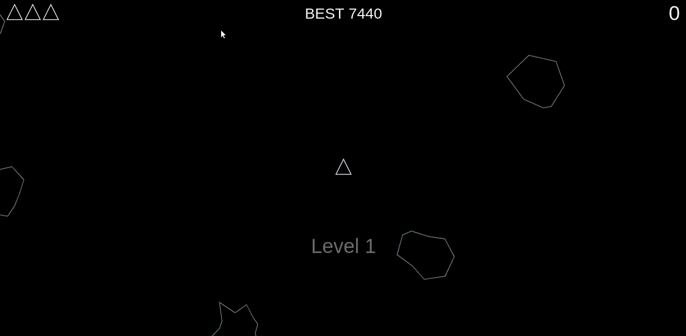

# Asteroids Game 

 


## Prerequisites

* A modern-web browser like Brave , Chrome , Firefox etc
* Computer...


## Getting Started

**1.** Fork [this](https://github.com/aman-atg/asteroids-game/) repository :fork_and_knife:

**2.** Clone your forked repository to your local system :busts_in_silhouette:
```sh
git clone https://github.com/<your-username>/asteroids-game.git
```
Or Download and extract the zip file.

## Running

1. Open the index.html file with VS Code's Live Server or Chrome's Live Server Extension

### Built With

* [HTML](https://www.html.com) - Standard markup language
* [CSS](https://css.com) - Style sheet language
* [JS](https://www.javascript.com/) - High-level, interpreted programming language
* [P5JS](https://p5js.org/) - It's a JavaScript library for creative coding, with a focus on making coding accessible and inclusive

### Authors

* **[Aman Ansari](https://github.com/aman-atg)**

### License

This project is licensed under the MIT License - see the [LICENSE.md](https://github.com/aman-atg/asteroids-game/blob/master/LICENSE) file for details

### Acknowledgments 

* [Original Asteroids Game](https://en.wikipedia.org/wiki/Asteroids_(video_game))
* [FCC-YOUTUBE](https://www.youtube.com/watch?v=H9CSWMxJx84)
* [Fighter jet Icon](https://iconscout.com/icons/fighter-jet") by [Iconscout](https://iconscout.com/contributors/iconscout)

